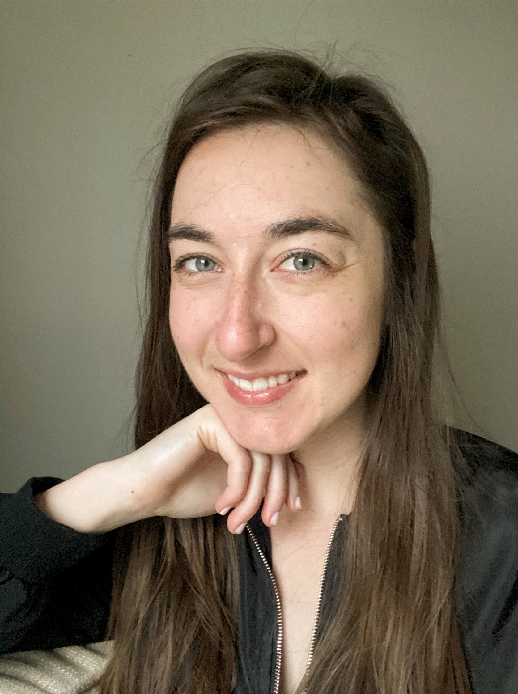
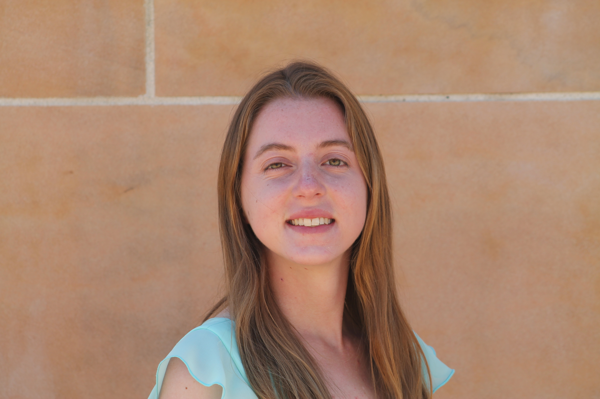
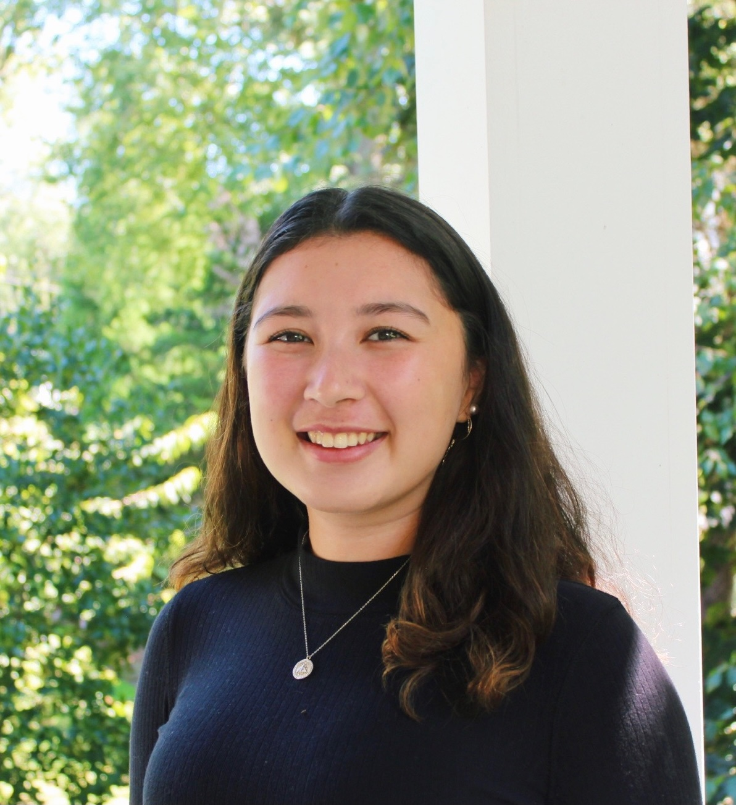
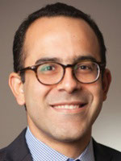
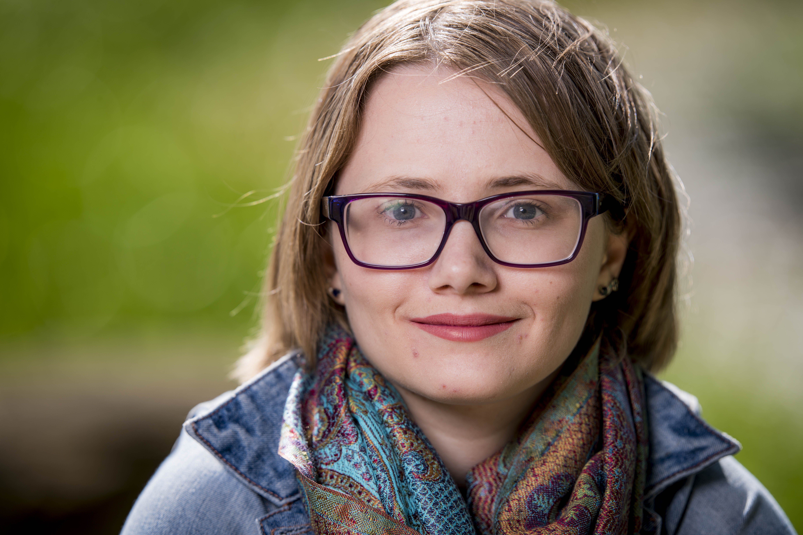
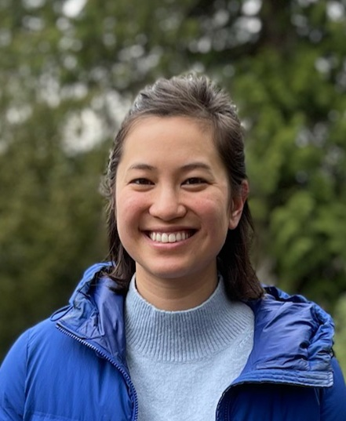
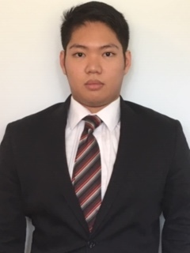
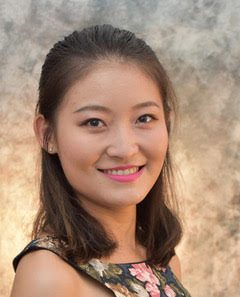
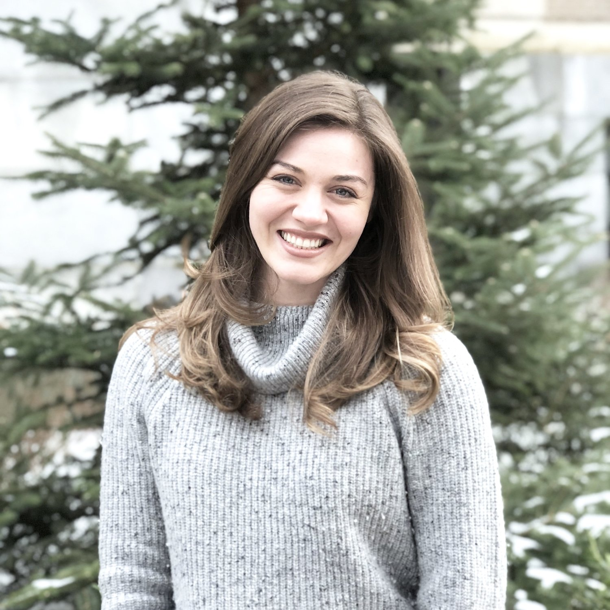

<html lang="en">
  <head>
    <meta charset="utf-8">
    <meta name="description" content="About Us">
  
  </head>

        

  <h2>About Us </h2>

  

  
  

</html>
        
 
 
 
    

<strong>Matt Comey</strong> is a Ph.D. candidate in the Economics program. His research interests are in public finance, urban economics, labor economics, and the economics of education. 

<a href="https://www.matthewcomey.com/">Matt's website</a>
 
<a href="https://twitter.com/matthewcomey">Matt's Twitter (@matthewcomey)</a>

    
 
 

<strong>Ren&eacute; Crespin</strong> is a Ph.D. candidate in the Policy Analysis and Management program. His research focuses on education, labor, and urban economics. 

<a href="https://twitter.com/Crespin_Rene">Ren&eacute;'s Twitter (@Crespin_Rene)</a>

 
 

<strong>Christa Deneault</strong> is a Ph.D. candidate in the Economics program. Her areas of research include labor economics, economics of education, and applied microeconomics. 

<a href="https://www.christa-deneault.com/">Christa's website</a>

 
 

<strong>Molly Doruska</strong> is an M.S./Ph.D. student in the Applied Economics and Management program. Her research interests are in development economics with a specific focus in Francophone Sub-Saharan Africa.

<!-- 
<a href="https://twitter.com/mdoruska3">Molly's Twitter (@mdoruska3)</a>
-->

 
 

<strong>Mia Glass</strong> is an undergraduate double majoring in Government and Economics with an International Relations minor. Her interests lie in the realm of global economic policies.

 
 
	

<strong>Ariel Ortiz-Bobea</strong> is our faculty advisor and an Assistant Professor of Applied Economics and Policy. His research fields are agricultural economics, environmental and resource economics, and applied econometrics, with a focus on climate change impacts and adaptation.

<a href="http://ortiz-bobea.dyson.cornell.edu">Ariel's website</a>
 
<a href="https://twitter.com/ArielOrtizBobea">Ariel's Twitter (@ArielOrtizBobea)</a> 

 
 

<strong>Grace Phillips</strong> is a Ph.D. candidate in the Economics program. She is interested in labor, public, and the economics of crime as they relate to vulnerable populations.

<a href="https://twitter.com/Grace_Nettie">Grace's Twitter (@Grace_Nettie)</a>

 
 

<strong>Kalie Pierce</strong> is a Ph.D. student in the Economics program. She is interested in labor economics, public economics, discrimination, and stratification.

 
 

<strong>Katharine Sadowski</strong> is a Ph.D. student in the Policy Analysis and Management program. She is interested in Natural Language Processing, education interventions, and the economics of education.

<a href="https://twitter.com/kcsadow">Katharine's Twitter (@kcsadow)</a>

 
 

<strong>Jose Maria U. Tapia</strong> is an undergraduate Economics major. He is interested in researching the economics of education and economic growth. 

 
 	

<strong>David Wasser</strong> is a Ph.D. candidate in the Economics program. He researches the intersection of labor market monopsony and public policy. 

<a href="https://www.davidnwasser.com">David's website</a>
 
<a href="https://twitter.com/dwasser2">David's Twitter (@dwasser2)</a>

 
 	

<strong>Meredith Welch</strong> is a Ph.D. student in the Policy Analysis and Management program. She is interested in labor economics, the economics of higher education, and social policy with a particular focus on gender disparities. 

<a href="https://twitter.com/meredithswelch">Meredith's Twitter (@meredithswelch)</a>

 
 

<strong>Julia Li Zhu</strong> is a Ph.D. candidate in the Policy Analysis and Management program. Her research interests are labor economics, economics of migration, and economics of education. 

<a href="https://www.julializhu.com">Julia's website</a>
 
<a href="https://twitter.com/julializhu">Julia's Twitter (@JuliaLiZhu)</a>

<!--
 
 

<strong>Adeline Yeh</strong> is a Ph.D. candidate in the Applied Economics and Management program. Her research ... 

-->
	
 
 
 
	

	

  <h2>Alumni </h2>

	

 

  

<strong>Ali Abbas</strong> received his Ph.D. in Applied Economics and Management from Cornell in 2021. His research interests are in public finance, political economy, and development economics, with a focus on fiscal policies in advanced and developing economies. Upon graduation, he joined the International Monetary Fund (IMF) as an Economist. 

<a href="https://www.ali-abbas.com/">Ali's website</a>
 
<a href="https://twitter.com/AliAbbas_Abidi">Ali's Twitter (@AliAbbas_Abidi)</a>

     
     

  

<strong>Anne Burton</strong> received her Ph.D. in Economics from Cornell in 2021. Her research focuses on the spillover effects of risky health behaviors and crime. Upon graduation, she joined The University of Texas at Dall as an Assistant Professor of Economics. 

<a href="https://annemburton.com">Anne (Burton's) website</a>
 
<a href="https://twitter.com/anne_m_burton">Anne (Burton's) Twitter (@anne_m_burton)</a>

     
     
    

<strong>Anne Byrne</strong> received her Ph.D. in Applied Economics and Management from Cornell in 2021. She studies the economics of food, with a particular interest in food assistance programs. Upon graduation, she joined the USDA's Economic Research Service (ERS) as a Research Agricultural Economist. 

<a href="https://www.econanne.com">Anne (Byrne's) website</a>
 
<a href="https://twitter.com/EconAnne">Anne (Byrne's) Twitter (@EconAnne)</a>
    
	
 
 

<strong>Sam Dodini</strong> received his Ph.D. in Policy Analysis and Management from Cornell in 2021. His research interests are broad but mainly focused on worker incentives, labor market institutions, education, and the effects of public expenditures on wellbeing. Upon graduation, he joined the NHH Norwegian School of Economics as a Postdoctoral Fellow in Labor Economics. 

<a href="https://samueldodini.com/">Sam's website</a>
 
<a href="https://twitter.com/microsamonomics">Sam's Twitter (@microsamonomics)</a>
	
	
 
 

<strong>Joy Wu</strong> received her Ph.D. in Applied Economics and Management from Cornell in 2021. She studies decision-making in the digital and information world, with a focus on consumer privacy, intellectual property, and data markets. Upon graduation, she joined the Institute for Strategy, Technology, and Organization (ISTO) at LMU-Munich as a Postdoctoral Researcher. 

<a href="https://joyzwu.github.io/">Joy's website</a>
 
<a href="https://twitter.com/joyzwu">Joy's Twitter (@joyzwu)</a>
	
	
	
 
 
 
 
    
<strong>If you would like to join us, feel free to reach out at
 
 
Cornell.DICE@gmail.com</strong>

 

 
 
 

     
  
